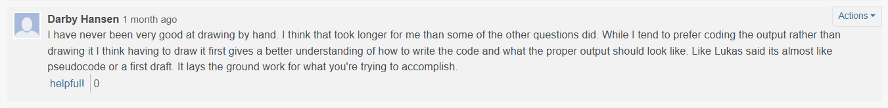
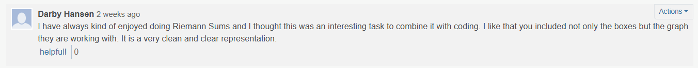
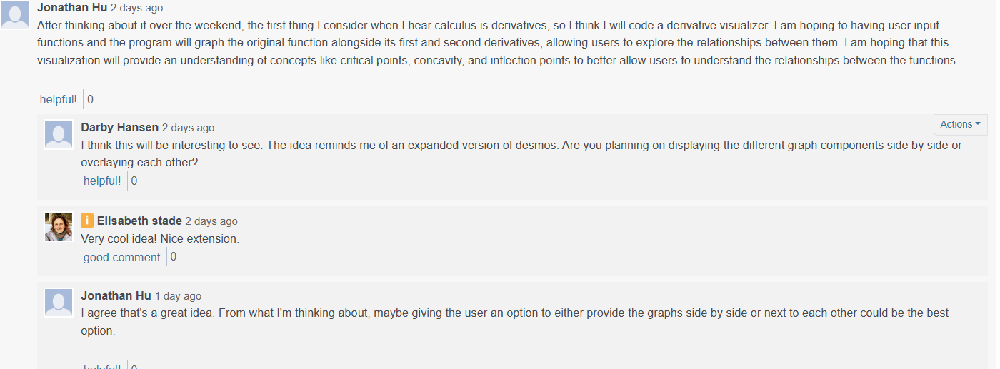

# CSPB4830 Portfolio

## Piazza Contributions
When I signed up for this course, I did not realize that the major emphasis was going to be group collaboration. I found this aspect to be fairly difficult to achieve given the
online environment we are learning in and therefore my portfolio of contributions is not as robust as I would like. I feel like I would have enjoyed this learning method much better in an in-person environment. As such, I did not have much in terms of contributions during the first half of the class, much of which I regret now. In the beginning, a couple of students tried to create a system where we each took on a seperate problem to complete and post. However, there was a struggle with scheduling that made it difficult to post them in a timely manner and it eventually fizzled out. I never did post my own takes or approaches to the assignments as there were others that had shared their work long before I had a chance to start the assignments because of a full work and school schedule. Instead, I tried to show appreciation for what others had contributed and add my own takeaways from what other people posted. I tried to add some helpful feedback or questions that might help move the idea forward. Here are just a couple examples of what I tried to contribute:

## Assignments and Class Takeaways
When it comes to the assignments, there were times I took what others had posted and tried to add my own influence or ideas to expand on what someone else did. In the Assignments folder I have added the assignments that I feel I did well on and the ones that I enjoyed doing. 

While I might not have had a lot in terms of contributions, I feel like I have taken a lot away from this class. My biggest takeaways from these assignments was learning how to think about a problem that seems complicated in a way that makes it much more achievable. My favorite example was, ironically, the very first activity we did. It involved solving two linear equations with six varialbes so that a value, Q, was minimized. This example showed how to rework the problem in to a real life scenario, making change. Because of this, the problem no longer seemed as complicated or extreme. It was put in the context of something that many of us do every day. The thing I never liked about math was that it felt like just memorizing how to do complicated problems and equations with little to no context. I feel like this class helped me figure out how to add my own context to equations to help me wrap my brain around what the equation is doing and what I am trying to accomplish. The book was very helpful in showing how a math equation relates to a real world scenario. For example, how finding the derivative of a function that relates to the time of sunrise can show how the rate of which the time of sunrise changes. Or how the SIR plot can be use to calculate the different values relative to a pandemic situation or hunter/ prey relations. In school people always ask when there will ever be a time they will use this math in the 'real world'. This class shows different scenarios of how this math works in real life and gave me the beginning blueprint of how to rework a problem in a way that is much more manageable to understand instead of just numbers on a page. 

When it came to connecting the math with coding, this class helped show me how useful it is to write a version of a first draft by hand as to how the function should operate. There were a few times I jumped right in and just started trying to code and wound up hitting a road block or having code function incorrectly. This is where the assignments that had us convert pseudocode to python was useful. Or the times where we had to draw a graph by hand before we even thought of coding. Taking a step back and looking at the big picture of what's supposed to happen allows you to think of the different actions taking place and what a correctly working output is supposed to look like. 
